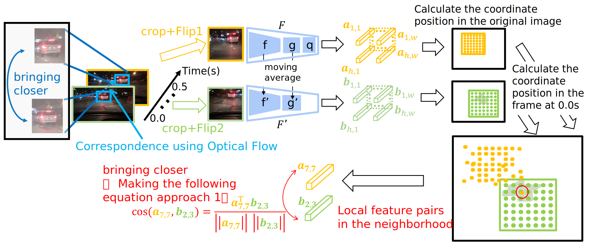

# Pixel-level Contrastive Learning of Driving Videos with Optical Flow

By Tomoya Takahashi, Shingo Yashima, Kohta Ishikawa, Ikuro Sato, Rio Yokota.
<!-- By [Tomoya Takahashi]()\*, [Shingo Yashima]()\*, [Kohta Ishikawa](), [Ikuro Sato](), [Rio Yokota](). -->

This repo is an official implementation of ["Pixel-level Contrastive Learning of Driving Videos with Optical Flow"](./demo/takahashi_cvpr2023_workshop_e2ead.pdf) on PyTorch.
<!-- This repo is an official implementation of ["Pixel-level Contrastive Learning of Driving Videos with Optical Flow"]() on PyTorch. -->


## Introduction
In this work, we improve the accuracy of self-supervised learning on driving data by combing pixel-wise contrastive learning (PixPro) with optical flow.
Unlike most self-supervised methods, PixPro is trained on pixel-level pretext tasks, which yields better accuracy on downstream tasks requiring dense pixel predictions.
However, PixPro does not consider the large change in scale of objects, commonly found in driving data.
We show that by incorporating optical flow into the pixel-wise contrastive pre-training, we can improve the performance of downstream tasks such as semantic segmentation on CityScapes.
We found that using the optical flow between temporarily distant frames can help learn the invariance between large scale changes,
which allows us to exceed the performance of the original PixPro method.

<!-- <div align="center">
    
    <p>An illustration of the proposed <b><em>PixPro</em></b> method.</p>
</div> -->
<div align="center">
    
    <!--  -->
    <p>Architecture of the Our methods.</p>
    <!-- <p>Architecture of the <b><em>PixContrast</em></b> and <b><em>PixPro</em></b> methods.</p> -->
</div>


## Citation

```
@article{tomo2023pixprowtopticalflow,
  title={Pixel-level Contrastive Learning of Driving Videos with Optical Flow},
  author={Tomoya Takahashi, Shingo Yashima, Kohta Ishikawa, Ikuro Sato, Rio Yokota},
  conference={IEEE/CVF Conference on Computer Vision and Pattern Recognition (CVPR) Workshop},
  year={2023}
}
```

## Main Results

### [_PixPro with Optical Flow pre-trained models_](https://drive.google.com/drive/folders/1kRdJwMKecPZvPeNab12IB74J1Gf0cb_e?usp=share_link)

|Epochs|Arch|Frames|Optical Flow|Download|
|:---:|:---:|:---:|:---:|:---:|
|2000|ResNet-50|1||[script](tools/pretrain_bdd100k_job_2000ep.sh) \| [model](https://drive.google.com/file/d/1cC-EncqJA55UPeOSJmwl50QdLMmlyCAZ/view?usp=share_link) |
|2000|ResNet-50|2|:heavy_check_mark:|[script](tools/pretrain_bdd100k_job_2000ep_nframe2_gpu16.sh) \| [model](https://drive.google.com/file/d/1ZdtonuVsUioOpPk3pKoPlg4vWzpBUPbE/view?usp=share_link) |
|2000|ResNet-50|6|:heavy_check_mark:|[script](tools/pretrain_bdd100k_job_2000ep_nframe6_gpu16.sh) \| [model](https://drive.google.com/file/d/1sUTKAjCO4PkC3zt0tHaH8BippJ1StbAP/view?usp=share_link) |
<!-- ## [_PixPro with Optical Flow pre-trained models_](https://drive.google.com/drive/folders/1Y-PpTfjofD_OrySYpeqLMHe9AEIqbriL?usp=share_link)
|2000|ResNet-50|1||[script](tools/pretrain_bdd100k_job_2000ep.sh) \| [model](https://drive.google.com/file/d/11rKnPR8zUu1Ontq4OXMzuwBdhw3I3zPu/view?usp=share_link) |
|2000|ResNet-50|2|:heavy_check_mark:|[script](tools/pretrain_bdd100k_job_2000ep_nframe2_gpu16.sh) \| [model](https://drive.google.com/file/d/1HQ9IHHzA4z33rP0CDmRhex77uR29-2XC/view?usp=share_link) |
|2000|ResNet-50|6|:heavy_check_mark:|[script](tools/pretrain_bdd100k_job_2000ep_nframe6_gpu16.sh) \| [model](https://drive.google.com/file/d/1XHwYi0KX9Ui380KcBqTCswOiutiqUeRo/view?usp=share_link) | -->

### _CityScapes Semantic Segmentation_

The results below show the average mIoU score over five training runs on downstream tasks.

* config: [config](https://github.com/rioyokotalab/detectron2/blob/dev-v0.6/projects/DeepLab/configs/Cityscapes-SemanticSegmentation/deeplab_v3_R_50_myencoder_mg124_poly_40k_bs8.yaml)

|Method|Epochs|Arch|PreDataset|Frames|mIOU|Download|
|:---:|:---:|:---:|:---:|:---:|:---:|:---:|
|Supervised|-|ResNet-50|ImageNet|-|61.2|-|
|BYOL|1000|ResNet-50|ImageNet|-|60.0|-|
|PixPro|100|ResNet-50|ImageNet|-|58.4|-|
|[PixPro](tools/pretrain_bdd100k_job_2000ep.sh)|2000|ResNet-50|BDD100k|1|53.0|-|
|[PixPro with OF (Ours)](tools/tools/pretrain_bdd100k_job_2000ep_nframe6_gpu16.sh)|2000|ResNet-50|BDD100k|6|53.4|-|

## Getting started

### _Requirements_

At present, we have not checked the compatibility of the code with other versions of the packages, so we only recommend the following configuration.

* Python 3.8.6
* PyTorch == 1.8.2
* Torchvision == 0.9.2
* CUDA == 10.2
* NCCL == 2.7.3
* Open MPI == 4.0.4
* Other dependencies

(If you want to fully replicate my current Python environment, please use `requirements_all.txt`.)

### _PrePare BDD100K and Optical Flow_

1. BDD100k Dataset  
See [img dataset inst](dataset_prepare/bdd100k/README.md) 

1. Optical Flow  
Please follow one of the following explanations depending on your environment.

  - Enough storage space for data  
  If you have enough storage space for the data, we recommend create optical flow dataset.

    See [optical flow dataset inst](dataset_prepare/raft_bdd100k/README.md)

  - No Enugh storage space for data  
  If you do not have enough storage space for the data, you can still run by simply downloading the pre-trained model for RAFT with the following steps.

    ```shell script
    cd ~
    git clone https://github.com/rioyokotalab/RAFT.git
    cd RAFT
    pyenv local pixpro-wt-of-cu102-wandb # pyenv virtualenv for this repo
    bash scripts/download_models.sh
    mkdir ${BDD100k-Path}/pretrained_flow
    cp -ra models ${BDD100k-Path}/pretrained_flow
    ```

### _Installation_

We recommand using pyenv virtual env to setup the experimental environments.
```shell
# Create working directory
mkdir ~/pixpro_wt_of_pj
cd ~/pixpro_wt_of_pj

# Create environment
pyenv virtualenv 3.8.6 pixpro-wt-of-cu102-wandb
pyenv local pixpro-wt-of-cu102-wandb

# If you are managing with modulefiles, please do the following.
module load cuda/10.2 cudnn/8.2.1 nccl/2.7.3 openmpi/4.0.4

# Install PyTorch & Torchvision
pip install torch==1.8.2 torchvision==0.9.2 torchaudio==0.8.2 --extra-index-url https://download.pytorch.org/whl/lts/1.8/cu102

# Install apex
git clone https://github.com/NVIDIA/apex
cd apex
git checkout 8a7a332539809adcad88546f492945c4e752ff49
pip install -v --disable-pip-version-check --no-cache-dir --global-option="--cpp_ext" --global-option="--cuda_ext" ./
cd ..

# Clone repo
git clone https://github.com/rioyokotalab/PixPro-with-OpticalFlow.git
cd ./PixPro-with-OpticalFlow

# Create soft link for data
mkdir data
ln -s ${BDD100k-Path}/bdd100k ./data/bdd100k
ln -s ${BDD100k-Path}/pretrained_flow ./data/pretrained_flow

# Install other requirements
pip install -r requirements.txt
```

### _Pretrain with PixPro using Optical Flow_

```shell script
# Train with PixPro base for 2000 epochs.
bash ./tools/pretrain_bdd100k_job_2000ep_nframe6_gpu16.sh
```

### _Transfer to CityScapes Semantic Segmentaion_

```bash
cd ~/pixpro_wt_of_pj/PixPro-with-OpticalFlow

# Convert a pre-trained PixPro model to detectron2's format
cd transfer/detection
python convert_pretrain_to_d2.py ${Input-Checkpoint(.pth)} ./output.pkl  

cd ~/pixpro_wt_of_pj
# Create environment
pyenv virtualenv 3.8.6 detectron2-cu102-wandb
pyenv local detectron2-cu102-wandb

# If you are managing with modulefiles, please do the following.
module load cuda/10.2 cudnn/8.2.1 nccl/2.7.3 openmpi/4.0.4

# Install PyTorch & Torchvision
pip install torch==1.8.2 torchvision==0.9.2 torchaudio==0.8.2 --extra-index-url https://download.pytorch.org/whl/lts/1.8/cu102

# Install Detectron2
git clone https://github.com/rioyokotalab/detectron2
cd detectron2
git checkout dev-v0.6
pyenv local detectron2-cu102-wandb
pip install -e .
pip install git+https://github.com/mcordts/cityscapesScripts.git
pip install wandb

# Train detector with pre-trained PixPro model without finetune
cd projects/DeepLab
python train_net.py --config-file Cityscapes-SemanticSegmentation/deeplab_v3_R_50_myencoder_mg124_poly_40k_bs8.yaml --output ./output --model_path ./output.pkl --no_finetune --num-gpus 4
```

## Evaluation code using detectron2
Supported for cityscapes semantic segmentaion, etc..
* https://github.com/rioyokotalab/detectron2


## Acknowledgement and Citing

Our testbed builds upon several existing publicly available codes. Specifically, we have modified and integrated the following code into this project:

* https://github.com/zdaxie/PixPro
* https://github.com/princeton-vl/RAFT

Please use the following BibTeX entry.

* PixPro
```
@article{xie2020propagate,
  title={Propagate Yourself: Exploring Pixel-Level Consistency for Unsupervised Visual Representation Learning},
  author={Xie, Zhenda and Lin, Yutong and Zhang, Zheng and Cao, Yue and Lin, Stephen and Hu, Han},
  conference={IEEE/CVF Conference on Computer Vision and Pattern Recognition (CVPR)},
  year={2021}
}
```
* RAFT
```
@article{raft,
  author     = {Zachary Teed and
                Jia Deng},
  title      = {{RAFT:} Recurrent All-Pairs Field Transforms for Optical Flow},
  journal    = {CoRR},
  volume     = {abs/2003.12039},
  year       = {2020},
  url        = {https://arxiv.org/abs/2003.12039},
  eprinttype = {arXiv},
  eprint     = {2003.12039},
  timestamp  = {Mon, 01 Feb 2021 18:33:24 +0100},
  biburl     = {https://dblp.org/rec/journals/corr/abs-2003-12039.bib},
  bibsource  = {dblp computer science bibliography, https://dblp.org}
}
```

## Contributing to the project

Any pull requests or issues are welcomed.
